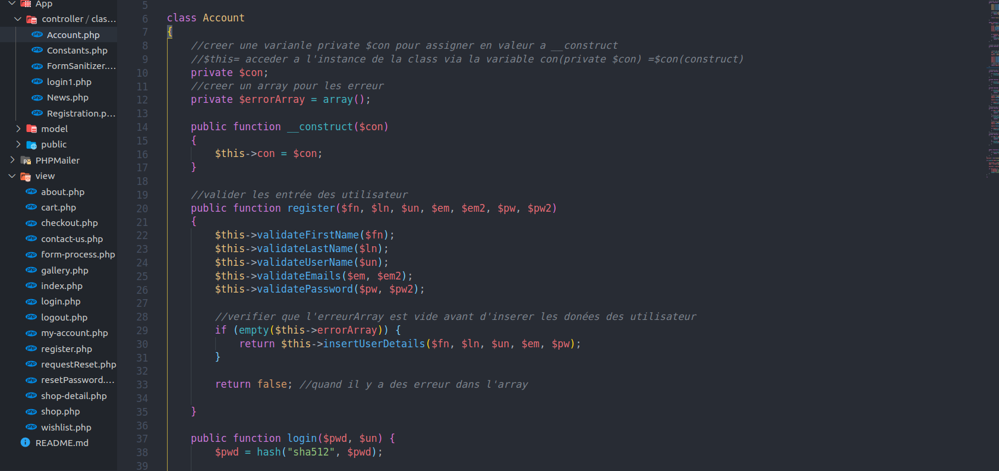
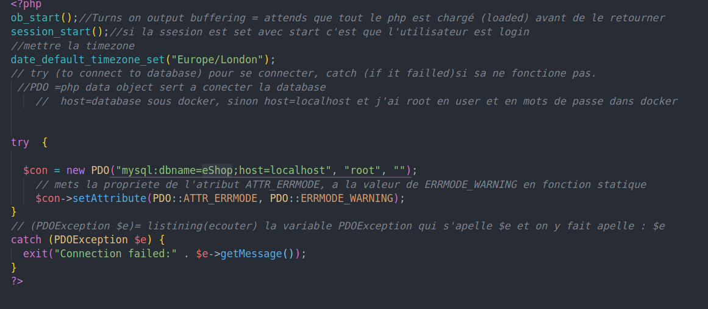
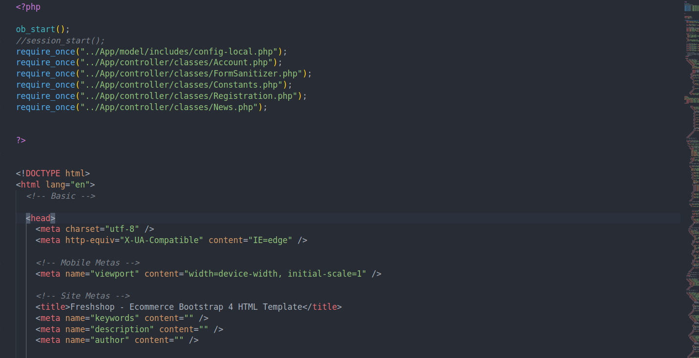
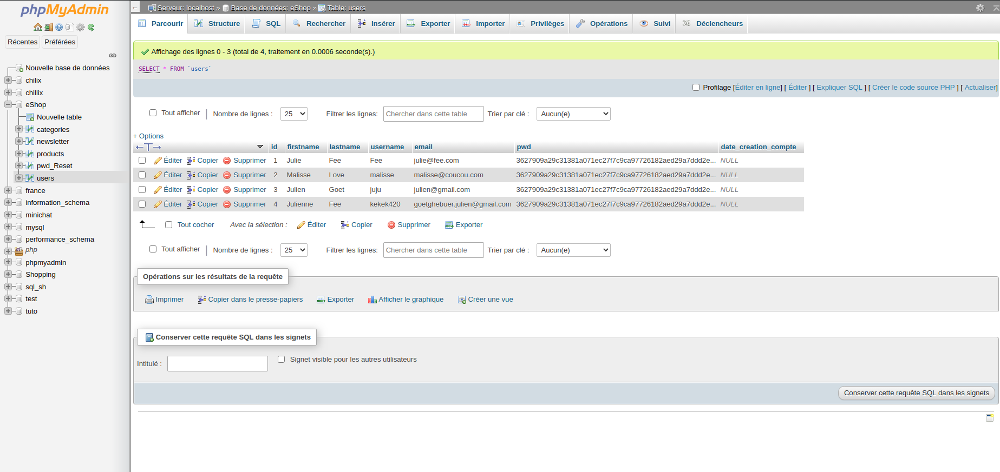
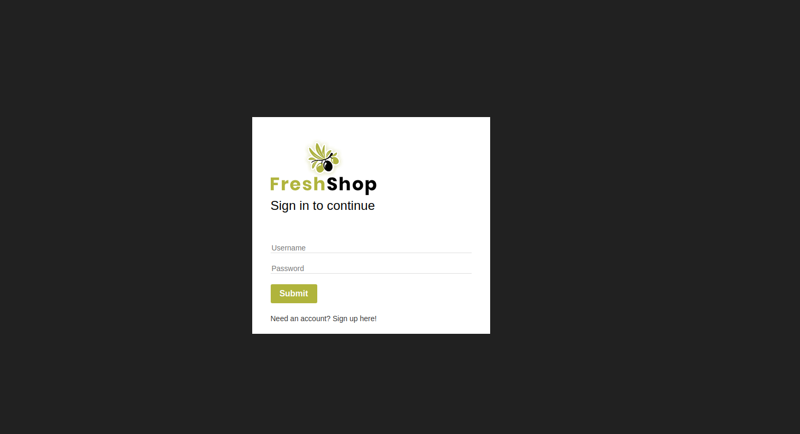

# eShop PHP OOP MVC

In this BeCode project in PHP OOP MVC style I have the folowing features

- Register & sign in/out

- Client account

- Research bar

- Newsletter (only add the email address to the database)
  This challenge is there to learn programing in Object oriented PHP with the MVC structure:

        - M = Model

        - V = View

        - C =  Controller

## ScreenShots of the code

In the controller:

Working with classes that where the same name of the file they are placed, starting with a capital letter

In the model:

Connection with PDO to the MySQL database in config.php

In the view:

With require once we link it to the called filles.
The view consist of files, the code that used tho display wat the users see

## ScreenShots of the site

BeCode Challenge

- Repository: OOP
- Type of Challenge: `Consolidation`
- Team challenge : `solo`

## Mission objectives

In this challenge, you will implement as many back-end functionalities as possible in OOP.

## The Mission

Freshshop is your new customer. They specialize in organic food and biodegradable bikes. Their store in Saint-Gilles is so profitable that they've opened another just below Thomas's apartment. To celebrate, they want to launch an e-commerce website at the same time.

Freshshop already owns the frontend part of the project. You must now implement the back-end with NodeJS or Php in OOP.

### Must-have features

- All the features of the home page must work

  - Register & sign in/out

  - Client account

  - Research bar

  - Newsletter (only add the email address to the database)

  - The shopping cart must work (add / remove / calculate / order)

### Nice-to-have features

- All img should be displayed dynamically
- The shop filters are working (sidebar shop)
- Wishlist
- Contact Us

### Miscellanous information

**Do not connect the platform to a payment system**

### Steps

1. Download the folder containing the template (clone the repo)
2. Analyze the different template files
3. Create the repository
4. Study the request (What & Why ?)
5. Identify technical challenges (How ?)
6. Create the ReadMe
7. Start Start coding in OOP

## Evaluation criterias

| Criteria       | Indicator                                                                     | Yes/No |
| -------------- | ----------------------------------------------------------------------------- | ------ |
| 1. Is complete | The student has realized all must-have features and one Nice-to-have feature  | No     |
|                | The rules of the MVC model and the OOP are respected                          | Yes    |
|                | The repo is clean                                                             | Yes    |
|                | The readme is clean                                                           | Yes    |
| 2. Is Correct  | The student has realized 4 of must-have features and one Nice-to-have feature | No     |
|                | The rules of the MVC model and the OOP are respected                          | Yes    |
|                | The repo is clean                                                             | Yes    |
|                | The readme is clean                                                           | Yes    |
